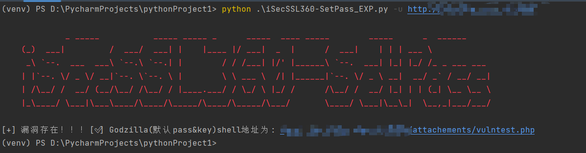
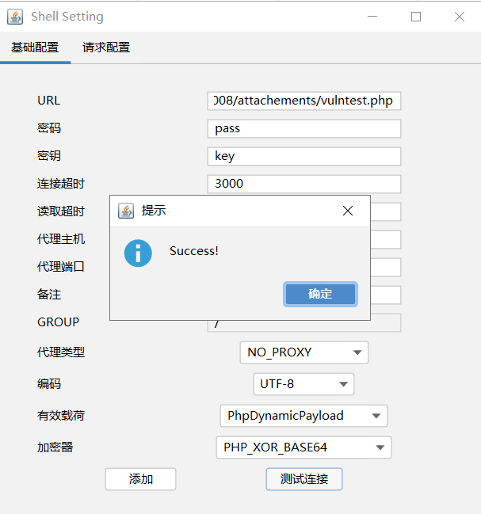

# iSecSSL360-SetPass_POC
网神 SecGate 3600 防火墙 obj_app_upfile接口存在任意文件上传漏洞验证脚本

### poc

```
usage: iSecSSL360-SetPass_POC.py [-h] [-u URL] [-f FILE] [-t THREAD] [-T TIMEOUT] [-o OUTPUT] [-p PROXY]

optional arguments:
  -h, --help            show this help message and exit
  -u URL, --url URL     Target url(e.g. http://127.0.0.1)
  -f FILE, --file FILE  Target file(e.g. url.txt)
  -t THREAD, --thread THREAD
                        Number of thread (default 5)
  -T TIMEOUT, --timeout TIMEOUT
                        Request timeout (default 3)
  -o OUTPUT, --output OUTPUT
                        Vuln url output file (e.g. result.txt)
  -p PROXY, --proxy PROXY
                        Request Proxy (e.g http://127.0.0.1:8080)
```

```
python '.iSecSSL360-SetPass_POC.py' -f .\url.txt -t 10
```

### exp

```
usage: iSecSSL360-SetPass_EXP.py [-h] [-u URL] [-T TIMEOUT] [-p PROXY]

optional arguments:
  -h, --help            show this help message and exit
  -u URL, --url URL     Target url(e.g. url.txt)
  -T TIMEOUT, --timeout TIMEOUT
                        Request timeout (default 3)
  -p PROXY, --proxy PROXY
                        Request Proxy (e.g http://127.0.0.1:8080)
```

```
python '.\iSecSSL360-SetPass_EXP.py' -u http://127.0.0.1
```



一键上传后通过哥斯拉连接


